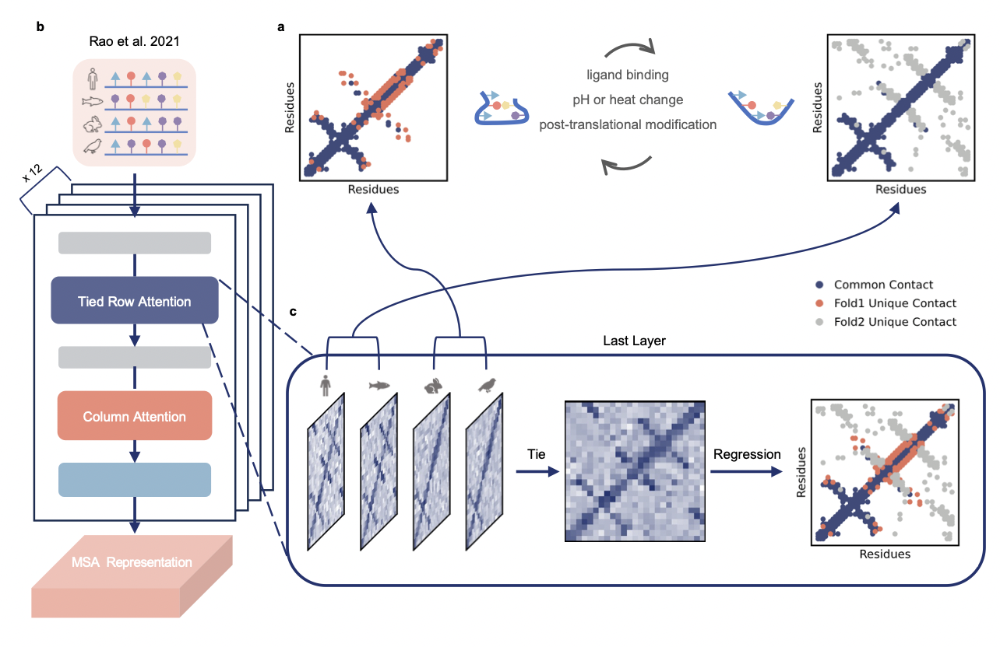

# EvoSplit

Code and data corresponding to "Disentangling Coevolutionary Constraints for Modeling Protein Conformational Heterogeneity".
<p align="center">
  
</p>

## Installation
EvoSplit builds on the MSA Transformer to separate coevolutionary signals of distinct protein conformations. Its environment setup is nearly identical to that of the [MSA Transformer](https://github.com/facebookresearch/esm). You can create a conda enviroment, and activate it:

```bash
conda env create -f environment.yml
conda activate evosplit
```

## Usage

### To generate MSA:

All MSAs used in this manuscript were generated using the [ColabFold notebook](https://colab.research.google.com/github/sokrypton/ColabFold/blob/main/AlphaFold2.ipynb).

### To cluster MSA and generate subsampled MSA files:

`python run_evosplit.py EX -i input.a3m -o evosplit_results`

To use this script, just type 'python run_evosplit.py -h' to see the help message.You can run a test case on KaiB using the following commands:

```bash
cd test/KaiB
bash ./slurm_evosplit
```

Outputs a directory named `evosplit_results` that contains

	| -- unsupervised_cluster
			| -- EX_0.a3m
			| -- EX_1.a3m
			...
	| -- EX.a3m
	| -- msatr_contact.png

`unsupervised_cluster`: MSA clusters identified by KMEANS.

`EX.a3m`: Subfamily MSAs generated after enhanced QID filtering of the input MSAs.

`msatr_contact.png`: Contact predictions generated by the MSA Transformer with EX.a3m as input.

### (Optional) To cluster the MSA using experimentally resolved conformations:
`python run_evosplit.py EX -i input.a3m -o evosplit_results -gt1 gt1.pdb -gt2 gt2.pdb`

The output directory additionally contains

	| -- supervised_cluster
			| -- gt1.a3m
			| -- gt2.a3m
`supervised_cluster`: MSA clusters classified based on match scores with the provided conformations.

### To extend MSA clusters
The excluded MSAs in QID filtering can be re-used to extend the clusters.

`python run_MSA_extend.py EX -i input.a3m
-o evosplit_results/unsupervised_cluster_extend
-MSA_cluster_dir evosplit_results/unsupervised_cluster`

EX_i.a3m files in the output directory: MSA clusters after extension.

### To run AF2:

`python RunAF2.py <my_subMSA.a3m>`

See https://github.com/jproney/AF2Rank for more information on compiling an AlphaFold2 installation.

### To run MSA Transformer:

`python runESM.py <my_subMSA.a3m> -o <outdir>`

### To perform unsupervised clustering of structures:
`python run_struct_clustering_tmscore.py EX --structure_dir <prediction directory>  --MSA_dir <MSA cluster directory> --output_dir <outdir>`

## Data Availability
All data are available from [Google Drive](https://drive.google.com/drive/folders/1VUdgsIM43L-Tye8F6gHpaGL-kxP9Njrw?usp=sharing).

